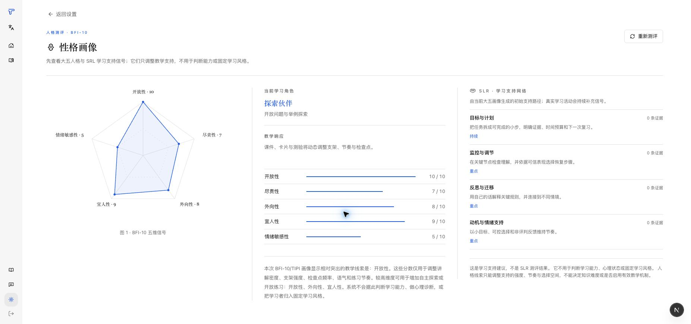
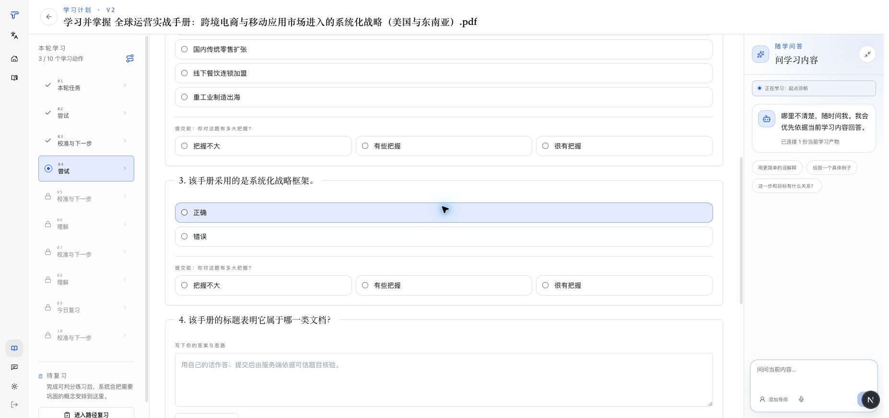
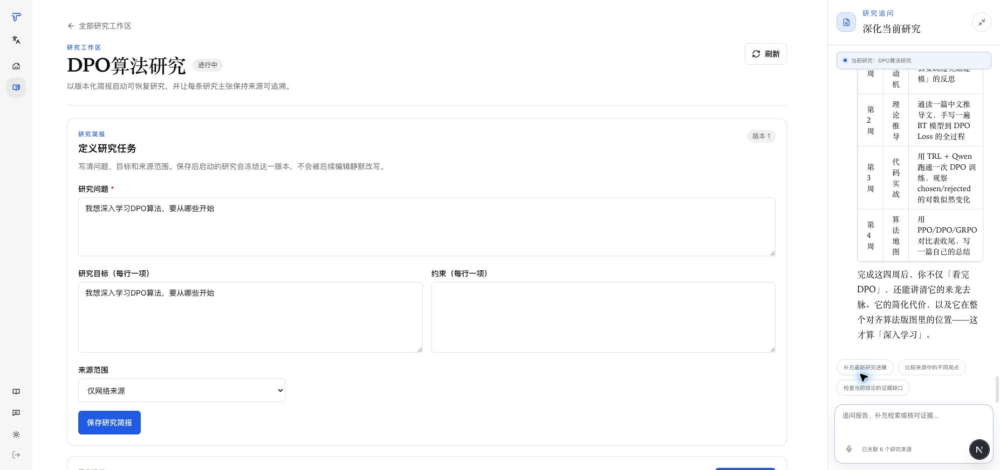
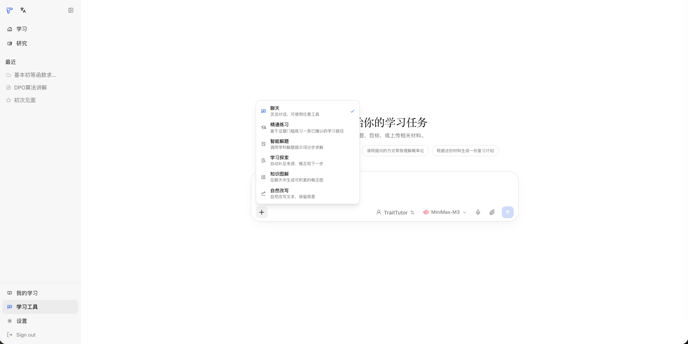
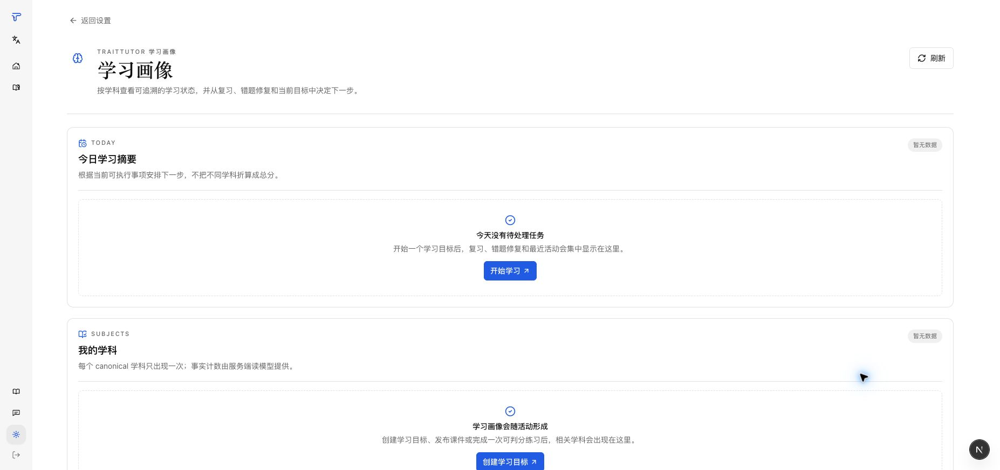
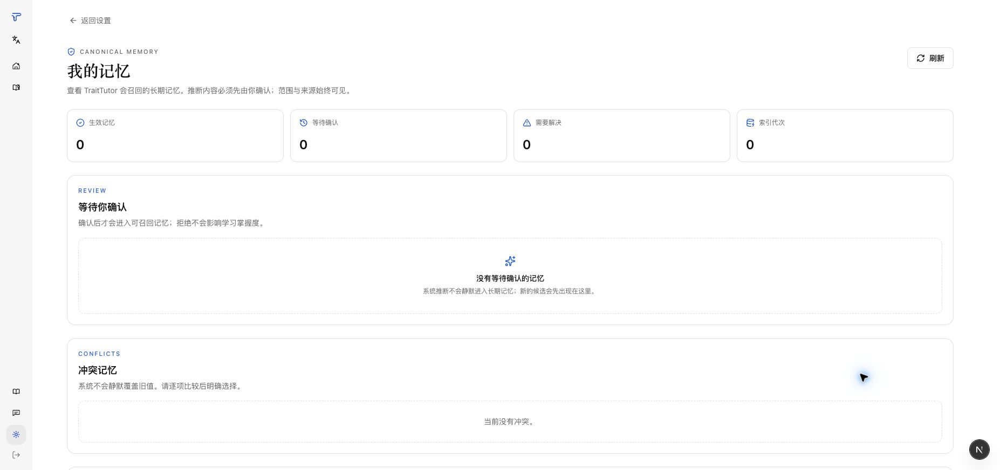

# TraitTutor

<p align="center">
  <strong>目标驱动的 AI 学习教练：把问题和真实材料转化为可自适应、可追溯证据的学习路径。</strong>
</p>

<p align="center">
  <a href="README.md">English</a>
  ·
  <a href="#核心功能">核心功能</a>
  ·
  <a href="#适用对象与场景">适用对象与场景</a>
  ·
  <a href="#技术方案与创新点">技术方案</a>
  ·
  <a href="#快速开始">快速开始</a>
  ·
  <a href="#验证命令">验证命令</a>
  ·
  <a href="#团队贡献与研究基础">团队贡献</a>
</p>

<p align="center">
  
  
  
  
</p>

TraitTutor 把一个学习目标、一道问题或真实学习材料转化为会持续根据证据调整的学习路径。用户可以不上传材料直接开始，也可以在需要时加入 PDF、Word、PPT、Excel、图片或文本；系统会结合来源证据、BKT 风格概念信号、学科支持动作和材料 affordance 安排下一学习组件，并在练习过程中始终呈现安排依据与学习证据。

个性化引擎把人格画像与 BKT 式概念信号结合，持续记住学习者：画像决定学习路径上的组件、节奏与反馈——画布上的组件序列就是人格个性化的直接产物——而只有服务端判分、归因可靠的作答才会更新学习证据。画像本身不构成诊断、能力标签或 BKT 证据。

## 适用对象与场景

TraitTutor 面向需要持续学习支持的自主学习者、教师/助教和学习产品团队，而不只是回答一次问题。用户可以从学习目标、问题或真实材料三个等价入口开始：例如把教材章节组织成练习路径、围绕真实 PDF 备考，或在 Quiz/闪卡证据显示薄弱概念后继续安排学习。

## 核心功能

- **基于材料的分析快照**：保存学科、年级段、难度、语言、候选概念、页码证据和是否需要外部补足。
- **安全的智能学习分流**：Learn 会先拦截可疑的提示注入，再通过 Gateway 判断此刻更适合一次性答疑还是持续学习；低置信度时由用户确认，不会擅自建档或写入学习画像。
- **目标驱动的学习路径**：从目标、材料或问题创建一个 Learning Pack 和确定性组件计划，不要求用户先选择生成器。
- **全屏学习画布**：同时展示学习路径、当前组件和“为什么这一步”的学习依据；进入学习后工作区侧栏自动收起。
- **一个材料，多种产物**：课件、闪卡、Quiz 可以共用同一个 Learning Pack，不需要重复上传和重复分析；它们也保留为可独立使用的学习工具。
- **学习事件回流**：Quiz 与短答等服务端判分结果会写入可审计的 LearnerEvent，并更新 BKT 风格的概念掌握进度；闪卡自评只记录参与进度。
- **可解释学习画像**：Reflection / Compass 记忆治理把显式偏好、推断支持、概念进度、证据和删除后重建分开管理。
- **聊天中的学习工作流**：支持聊天、Deep Research、解题、学习探索、知识图解，以及对已生成产物的二次追问。
- **基于特质的支持边界**：个人画像用于调整表达与支持动作，不把人格分数变成标签或判断。
- **人工质量确认**：评测发现问题的生成结果会先进入待确认状态，只有用户确认后才写入学习包或作为可判分组件使用。
- **统一模型网关**：生成、意图分类和聊天统一走 Gateway，便于路由、重试、备用模型和调用审计。

## 工作流

```text
学习目标 / 材料 / 问题
        ↓
LearningPack + MaterialAnalysisSnapshot（有材料时）
        ↓
BKT 概念证据 + 学科 SLR 支持 + 材料 affordance
        ↓
LearningComponentPlan
        ↓
全屏学习画布
        ↓
讲解 / 评估 / 主动回忆 / 图解 / 语音执行器
        ↓
LearnerEvent → BKT / 知识图谱 / 学习画像
        ↓
只重规划未开始的路径尾部 → 下一学习组件
```

学习路径是默认的持续学习目的地；课件、闪卡和 Quiz 同时作为可独立使用的学习工具，也能关联到同一个学习包。课件完成和闪卡自评只作为参与证据。长期掌握度只由服务端可验证的作答结果更新，例如 Quiz 和短答掌握练习。

学习画布是持续学习目的地；Assistant 则面向一次性研究、分析、解题和表达任务。用户在 Learn 中输入内容时，系统只在高置信度下自动分流；模糊输入、分类失败或模型不可用时会提供明确选择。可疑的越权指令、提示泄露要求或附件内指令不会被用于自动分流、建包或写入学习画像。TraitTutor 自有 UI 状态支持中英文切换，用户输入和材料原文保持原始语言。

## 技术方案与创新点

```text
Next.js 学习工作台
        ↓ 学习目标 / 问题 / 材料
FastAPI 产品 API → 材料分析 → Learning Pack + 组件计划
        ↓                              ↓
已配置的模型网关                    可持久化学习事件
        ↓                              ↓
课件 / 闪卡 / Quiz                  BKT 风格概念证据 + 学习画像
```

核心设计是在模型生成内容时，仍让学习顺序保持可确定、可解释：材料证据、概念信号、学科支持动作和用户明确偏好共同决定组件计划，生成产物只负责执行该计划。可判分的 Quiz 作答和闪卡复习会写入可审计事件；系统仅重规划尚未开始的路径尾部，不改写已完成的学习证据。

## 团队贡献与研究基础

TraitTutor 的教育个性化内核来自团队尚未发表的“受限学习支持路由”研究。为保护在研成果，本仓库不公开论文题目、参与者记录、产品运行所需范围以外的研究工具、统计结果、完整路由矩阵、实验条件或研究提示词；这里只披露足以界定团队实现贡献的最小设计边界。团队不依据该未发表研究宣称客观学习增益、长期效果或因果关系。

以下是本团队在比赛中申报的核心贡献：

- **受限的画像 → 教学支持路由**：简式学习者画像只产生可调整的教学支持线索；在产品中这就是组件选择、节奏与反馈背后的个性化引擎，它始终是支持信号，不是诊断、能力标签、固定学习风格或 BKT 证据。仓库只保留产品运行和审查该边界所需的规则，研究版完整路由矩阵和实验变体保持私有。
- **固定内容与可变支持层分离**：材料中的目标、概念、术语和事实边界保持可追溯；个性化只改变支持、反馈与节奏，不改变来源事实或判分规则。
- **可审计生成与受限修复**：结构化生成保留来源证据和可复核运行记录；评价失败进入有限修复或人工确认，不让有疑问的产物自动成为学习证据。
- **系统证据与学习者证据分层**：模型评价、生成差异和路由 trace 只说明实现过程；只有服务端可信判分、有效题目和可靠知识点归因才能更新学习证据。浏览、停留、人格分数和自报掌握不会更新 BKT。
- **重写 Core Learning 核心学习链路**：团队实现了从材料上传、Learning Pack 与组件计划，到已发布课件、闪卡、Quiz、不可变 LearnerEvent、服务端判分、错题修复与复习、按学科隔离的学习画像和可恢复进度的完整产品链路；剩余路径变化时不会改写已经完成的学习证据。
- **重写 ResearchWorkspace 核心研究链路**：团队实现了版本化研究简报、可持久化和恢复的研究运行、显式来源策略、分层保存的来源/主张/笔记、来源失效、冲突审阅、版本化报告和基于证据的连续追问。检索证据与模型推断保持可见分离，研究主张保留来源关联。
- **新增 Learning Tools 学习工具工作台**：团队新增了独立的 `/assist` 工作台，提供聊天、精通练习、智能解题、学习探索、知识图解和自然改写六种显式模式。模式通过 typed metadata 传递，用户原文保持不变，能力提示词由服务端持有；普通对话不会被静默转换为 Learning Pack、研究运行或学习证据更新。
- **产品自有的持久化与治理**：团队实现了用户可治理记忆，以及覆盖学习、研究、画像和会话领域的 owner-bound SQLite 运行时存储。

本仓库同时复用了 [HKUDS/DeepTutor](https://github.com/HKUDS/DeepTutor) 的部分通用 Agent、模型接入、RAG、解析与前端基础组件；这些内容遵循 Apache-2.0，不作为团队独立创新申报。完整来源和许可证见 [THIRD_PARTY_NOTICES.md](THIRD_PARTY_NOTICES.md)。

## 核心功能截图

**画像只生成有边界的教学支持线索，不形成能力或心理标签。**



**核心学习页把可恢复路径、起点诊断、作答信心、服务端判分和随问助手放在同一流程中。**



**重写后的 ResearchWorkspace 把版本化简报、可恢复运行、证据工作区和报告追问组织成同一条来源可追溯链路。**



**新增的 Learning Tools 工作台提供六种显式模式，同时保持普通对话与 Core Learning、Research 运行时隔离。**



**学习证据按学科隔离并由服务端持有；没有证据时明确显示暂无数据。**



**推断记忆必须经过用户确认，并支持冲突处理、停用、删除和索引审计。**



以上截图来自本地脱敏 Demo 状态，只用于展示界面行为，且不含可识别到真实个人的账户信息或参与者记录；仓库不包含示例学习材料原文、研究来源语料、画像原始答案、学习者作答或运行时记录。

## 开源、依赖与服务边界

TraitTutor 仓库代码采用 [Apache-2.0](LICENSE) 协议；Python 依赖以 `pyproject.toml` 为准，前端依赖以 `web/package.json` 和 `web/package-lock.json` 为准，第三方来源及许可证见 [THIRD_PARTY_NOTICES.md](THIRD_PARTY_NOTICES.md)。模型网关可以连接本地配置的商业或开源模型服务，但仓库不包含服务商密钥、模型权重、私有用户材料、论文实验记录或专有服务输出。

## 路线图与落地计划

当前版本聚焦可运行的“目标 → 学习路径”、材料分析、练习证据回流和可解释下一步。生成评测采用人工确认机制，持久化 TTS 资产可附加到学习组件；持续维护重点是覆盖“安全分流 → 学习路径 → 练习 → 产物确认/追问”的浏览器 smoke 测试。

### 公开验收标准

发布前应以当前用户身份验证：可疑提示和附件内指令不会创建路径或写入画像；低置信度输入在任意 Learn 会话中始终提供明确选择；学习路径可在刷新后恢复题目和进度；只有服务端验证的答题结果更新掌握度并触发尾部重规划；待确认生成物必须经确认后才可附加到 Learning Pack；Assistant 会话、学习路径和独立工具各自可访问且不会混淆历史记录。回归至少覆盖真实服务端的两用户隔离、上述学习闭环和浏览器关键旅程。

## 快速开始

### 本地一键开发启动

```bash
./scripts/start_local_dev.sh
```

脚本会启动 API（`http://127.0.0.1:8001`）和前端（`http://127.0.0.1:3782`），
两端都会在源码变更后自动热更新。首次运行时会创建 `.venv`，并安装缺失的 Python
或前端依赖；按 `Ctrl-C` 会同时停止两个服务。

### 容器启动

```bash
python scripts/docker_compose.py up --build -d
python scripts/docker_compose.py logs -f
python scripts/docker_compose.py down
```

包装器固定使用唯一的 `compose.yaml`，并读取 TraitTutor 设置中的端口；宿主机默认只
监听 `127.0.0.1`。

### 环境要求

- Python 3.11、3.12 或 3.13
- Node.js 20+
- npm

### 后端

```bash
python -m venv .venv
source .venv/bin/activate
pip install -e .

python -m uvicorn traittutor.api.main:app --host 127.0.0.1 --port 8001
```

### 前端

```bash
cd web
npm install
npm run dev
```

本地运行配置来自 `web/.env.local`、`config/models.local.yaml` 等已忽略文件。请根据示例文件创建本地配置，不要提交真实模型密钥。

## 配置模型

模型配置采用本地优先，提供两种模板：

- `config/models.local.example.yaml` — 使用 `env(VAR)` 引用（已提交到仓库）
- `config/models.local.template.yaml` — 使用显式占位符值（已加入 .gitignore）

**配置步骤：**

```bash
# 1. 复制示例模板（推荐）
cp config/models.local.example.yaml config/models.local.yaml

# 2. 编辑 config/models.local.yaml 并填入你的 API 密钥
# 3. 修改 `active` 字段设置默认模型
```

**文件结构：**

```yaml
active: zhipu-glm                    # 默认模型 id（必须与下方某个模型 id 匹配）

models:
  - id: zhipu-glm                    # 稳定标识符（代码/配置中使用；编辑时请保持稳定）
    name: Zhipu GLM 5.2              # 模型选择器中显示的人类可读标签
    binding: custom_anthropic         # 供应商集成键（见下方说明）
    base_url: https://...             # 供应商端点 URL
    api_key: env(ZHIPU_API_KEY)       # 你的 API 密钥，或 env(VAR_NAME) 从环境变量读取
    model: glm-5.2                    # 发送给供应商 API 的模型标识符
    context_window: 128000            # 可选：最大上下文 token 数
```

**Binding 类型对照表**（`binding` 字段）：

| Binding | 说明 |
|---------|------|
| `custom` | OpenAI 兼容端点 |
| `custom_anthropic` | Anthropic API 兼容端点 |
| `anthropic`, `openai`, `deepseek`, `zhipu`, `moonshot`, … | 内置供应商快捷方式（见 `traittutor/services/provider_registry.py` PROVIDERS） |

**API 密钥格式：**

```yaml
# 内联明文密钥（不推荐 — 有提交密钥的风险）
api_key: "sk-xxxxxxxx"

# 环境变量引用（推荐）
api_key: env(MY_API_KEY)
```

在 shell 或 `.env` 文件中设置环境变量：

```bash
export ZHIPU_API_KEY="sk-xxxxxxxx"
export DEEPSEEK_API_KEY="sk-xxxxxxxx"
```

**常用供应商配置示例：**

```yaml
# Zhipu GLM（custom_anthropic binding）
- id: zhipu-glm
  name: Zhipu GLM 5.2
  binding: custom_anthropic
  base_url: https://open.bigmodel.cn/api/anthropic
  api_key: env(ZHIPU_API_KEY)
  model: glm-5.2

# DeepSeek V4（custom_anthropic binding）
- id: deepseek-v4
  name: DeepSeek V4
  binding: custom_anthropic
  base_url: https://api.deepseek.com/anthropic
  api_key: env(DEEPSEEK_API_KEY)
  model: deepseek-v4-pro

# OpenAI GPT-4o（openai binding）
- id: openai-gpt4o
  name: GPT-4o
  binding: openai
  base_url: https://api.openai.com/v1
  api_key: env(OPENAI_API_KEY)
  model: gpt-4o
  context_window: 128000

# Anthropic Claude Sonnet 4（anthropic binding）
- id: anthropic-sonnet
  name: Claude Sonnet 4
  binding: anthropic
  base_url: https://api.anthropic.com
  api_key: env(ANTHROPIC_API_KEY)
  model: claude-sonnet-4-20250514
  context_window: 200000
```

**运行时路径优先级：** 加载器优先检查 `$TRAITTUTOR_HOME/config/models.local.yaml`
（生产/符号链接部署），然后回退到仓库根目录 `config/models.local.yaml`
（本地开发）。当文件不存在或为空时，LLM 目录回退到其 JSON 默认值（空）— 请至少定义一个模型以启用聊天。

**自动生成：** 使用 `traittutor models sync-cc-switch` 与 CC Switch 供应商同步。

## 验证命令

```bash
# 后端
pytest
ruff check .
ruff format --check .
mypy traittutor

# 前端
cd web
npm run lint
npm run build
npm run test:e2e
```

按改动影响范围运行相应检查；真实模型、成本、部署和通知链路必须单独验收。前端使用系统字体栈，`npm run build` 不依赖远程字体下载。

## 目录结构

```text
traittutor/                 FastAPI 后端、生成链路、Gateway、学习画像
web/                        Next.js 前端
config/                     运行配置示例
scripts/                    本地运维辅助脚本
docs/assets/readme/         公开且经过筛选的产品截图
```

## 产品安全边界

TraitTutor 把画像和记忆信号当作可调整的教学上下文。它不会：

- 诊断人格、认知或能力；
- 用画像数据声称客观学习增益；
- 把浏览、保存或看完课件当作已掌握；
- 在解释中暴露隐藏 prompt 或私有推理。

意图识别只用于决定产品界面和学习流转，不是执行代理。它不调用工具、不读取记忆或附件正文；用户材料会作为不可信数据处理。安全拦截只记录最小审计信息，不展示检测规则或隐藏系统提示。

Why Drawer 应展示当前目标、材料证据、薄弱概念、显式偏好、教学动作和降级状态；不展示隐藏思维链、原始 prompt 或人格判断。

## 贡献

提交改动前，请说明影响的产品入口、数据所有者和验证范围；涉及共享 composer、学习证据、存储迁移或公开路由时，应同时提供相应后端测试和浏览器回归。不要提交真实 API 密钥、用户材料、参与者记录、运行时数据库或未发表论文附件。

## 许可证

TraitTutor 使用 [Apache License 2.0](LICENSE)。第三方来源、修改基础和相应许可证见 [THIRD_PARTY_NOTICES.md](THIRD_PARTY_NOTICES.md)。
