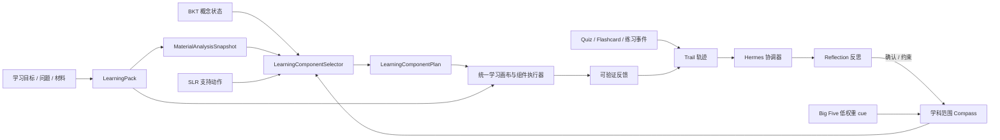

# TraitTutor 个性进化与 Hermes 设计

**状态：** 已实现基线，持续融合　**更新时间：** 2026-08-05

## 1. 设计目标

当前代码的 `L1/L2/L3` 是一种实现分层：原始轨迹、表面摘要、跨表面摘要。它可以继续作为迁移期内部目录，但不再作为产品概念。新设计表达的是：用户不是被固定分类，而是在学习证据、反馈和主动确认中逐步形成可撤销的个性化策略。Hermes 不负责替用户安排一切学习内容，而是把经过治理的上下文交给确定性的学习组件编排器。

## 2. 新命名

| 新概念 | 中文 | 作用 | Agent 是否可直接读取 |
|---|---|---|---|
| `Trail` | 学习轨迹 | 带时间、来源和原始证据的事件 | 否 |
| `Reflection` | 学习反思 | 从 Trail 提出的结构化观察、偏好、目标和概念信号 | 仅经筛选 |
| `Compass` | 个性化罗盘 | 为当前任务裁剪出的最小策略上下文 | 是 |
| `Hermes` | 赫尔墨斯协调器 | 负责观察、提案、确认、应用、反馈、审计 | 不是存储层 |

Hermes 是“传递上下文与解释”的协调器，不是拥有自主画像权的 Agent。产品 UI、API、事件和新字段统一使用这四个概念；旧 `L1/L2/L3` 仅作为迁移映射保留。

## 3. 数据流



主链路是“目标/来源 → Pack → 组件计划 → 全屏学习画布”。Hermes 只在构建 `PersonalizationContext` 时提供最小、可解释、按学科/任务裁剪的个性化上下文；它不把学习循环渲染成聊天长文本，也不直接生成一个不可审计的自由路径。

## 4. Hermes 演化协议

每次 Hermes 运行都必须可审计，并按以下顺序执行：

1. **Observe**：只读取与当前任务相关的 Trail，不读取全量历史。
2. **Reflect**：提出带 `evidence_refs`、置信度、适用范围和失效时间的 Reflection。
3. **Ask/Confirm**：涉及长期偏好、跨学科结论或人格解释时，先请求用户确认；默认不自动升级。
4. **Apply**：把已确认或满足规则的 Reflection 压缩成当前任务 Compass。
5. **Learn**：记录反馈和可验证结果，形成新的 Trail；不得直接覆盖 Big Five profile。

核心原则：提案可以被拒绝，罗盘可以被关闭，轨迹可以被追溯。

## 5. 与学习组件、BKT 和 SLR 的边界

| 层 | 负责什么 | 不负责什么 |
|---|---|---|
| `Trail` | 保存有来源的原始事件、用户纠正和结果 | 不直接修改掌握概率，不直接给 Agent 全量读取 |
| `BKT` | 根据 Quiz、掌握练习、Flashcard 等可信事件更新概念状态 | 不决定用户喜欢什么表达，不读取人格解释 |
| `SLR` 支持状态 | 选择临时教学支持动作与强度 | 不输出学习风格、能力或诊断标签 |
| `Reflection` | 提出可确认、可拒绝、可失效的偏好/目标/策略/概念观察 | 不绕过治理成为长期事实 |
| `Compass` | 为当前 Pack/组件压缩已确认的最小上下文 | 不保存全量历史、原始 prompt 或隐藏推理 |
| `LearningComponentPlan` | 把 BKT、SLR、材料 affordance 和显式请求排成可完成的组件路径 | 不把课件/闪卡/Quiz 重新暴露为首页模式选择 |

因此，BKT 解释“概念状态如何变化”，SLR 与 Compass 解释“当前怎么支持”，组件计划解释“下一步做什么”。删除证据时，Trail、Reflection、Compass、BKT 和知识图谱按证据引用 deterministic rebuild；学习组件只重规划尚未开始的路径尾部，已完成组件保持不可变。

## 6. 什么可以进化，什么不能进化

可以进化：解释偏好、节奏偏好、反馈方式、练习目标、学科范围、概念熟悉度、对某种教学策略的明确反馈。

不能自动进化：Big Five 分数、人格标签、智力/能力等级、诊断、情绪诊断、跨用户画像。一次点击、停留时长或一次答错不能单独形成长期结论。

优先级固定为：当前用户指令 → 当前任务选项 → 已确认的学科 Reflection → 已确认的全局 Reflection → 可验证策略证据 → Big Five 低权重先验 → 通用默认策略。

## 7. 迁移映射

| 旧实现 | 新语义 | 迁移规则 |
|---|---|---|
| `trace/`、`L1` | `Trail` | 保留历史文件；新 API 不暴露 L1 |
| `L2/` | `Reflection` | 保留表面归纳能力；新 UI 显示为反思 |
| `L3/` | 旧的跨表面迁移来源 | 只读、默认不直接注入 Agent；经用户确认后才能进入 Reflection |
| 新增 `Compass` | 当前任务上下文 | 版本化、最小化、短期有效；生成结果保存其版本和证据 |
| 新增 `Hermes` | 协调服务 | 不新建第二套存储、身份或模型调用通道 |

迁移期允许内部测试继续使用旧目录名，避免破坏历史数据；但新增代码、文档、UI 文案和接口字段不得继续扩散 `L1/L2/L3`。

## 8. 当前代码落点

```text
traittutor/services/evolution/core.py      # Trail / Reflection / Compass / Hermes / policies
traittutor/services/evolution/__init__.py  # 领域类型导出
traittutor/api/routers/personalization.py  # Reflection 查询、确认、拒绝与重建边界
traittutor/personalization/service.py      # PersonalizationContext 与学科隔离
traittutor/learning_components.py          # BKT + SLR + affordance 的组件计划
traittutor/api/routers/learning_packs.py   # Pack、计划版本与组件事件
web/components/learning/LearningCanvas.tsx # 全屏学习画布与 Why Drawer
web/components/personalization/LearnerModelApp.tsx
web/app/(utility)/profile/learning-model/[subjectId]/page.tsx
```

第一阶段不移动旧存储目录。旧存储只作为迁移/兼容适配器双读；新增代码不得再扩散 `L1/L2/L3` 产品命名。当前领域层已落在 `core.py`，后续只有在双读、删除重建和跨学科回归完成后，才考虑物理迁移。

## 9. 前端产品契约

- 主页负责接收目标、材料或问题，创建/恢复 LearningPack，并展示路径预览。
- `/space/learning/{packId}` 是真正的学习入口：桌面端全屏展示“学习路径 / 当前组件 / 学习依据”三栏；进入学习路径后左侧工作区导航自动收起。
- 课件、Flashcards、Quiz、图解、语音是组件执行器和历史产物，不在首页作为模式选择；旧链接仍可回看、导出和二次问询。
- Why Drawer 只展示当前目标、材料证据、薄弱概念、已确认偏好、教学动作和降级状态，不展示原始 prompt、隐藏推理或人格判断。
- TraitTutor 自有 UI 的标题、按钮、加载、错误、空状态、弹窗、ARIA 标签和 Why Drawer 必须支持中英文切换；用户输入、材料原文、文件名和生成内容保持原始语言。

## 10. 验收标准

- 新增/读取 Compass 的 Agent 不接收全量 Reflection 或原始 Trail。
- 每条 Reflection 都能追溯至少一个 Trail 或用户明确指令。
- 用户可以查看、确认、拒绝、修改和删除 Reflection。
- 删除 Trail 后，关联 Reflection/Compass 标记 `needs_rebuild`，不得静默保留。
- Hermes 或存储故障时，Chat、课件、闪卡和 Quiz 回退到通用策略，不阻断主任务。
- 生成结果保存 `compass_version`、策略摘要、证据引用和 Hermes 降级状态。
- 现有 L1/L2/L3 历史数据可读，且不发生破坏性迁移。
- 从目标/材料/问题进入学习路径后，用户进入全屏学习画布，而不是在聊天中阅读整段学习循环。
- 组件事件只重规划未开始的路径尾部；已完成组件和证据保持可追溯。
- 全局中英文切换覆盖学习画布、学习画像、设置、导航以及所有加载/错误/空状态。
